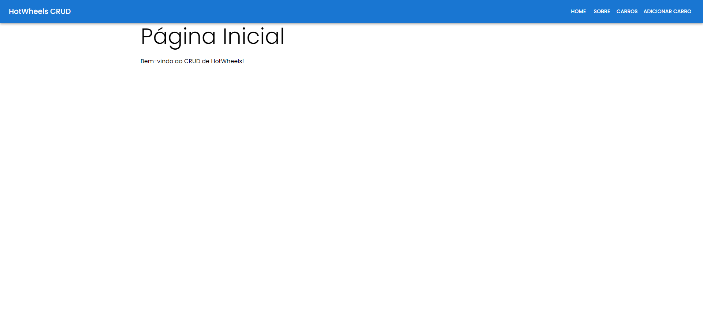
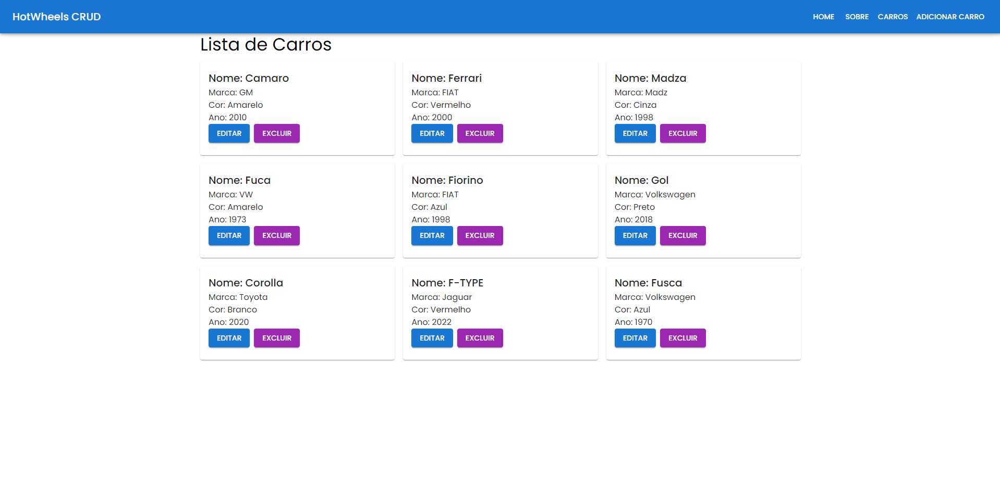
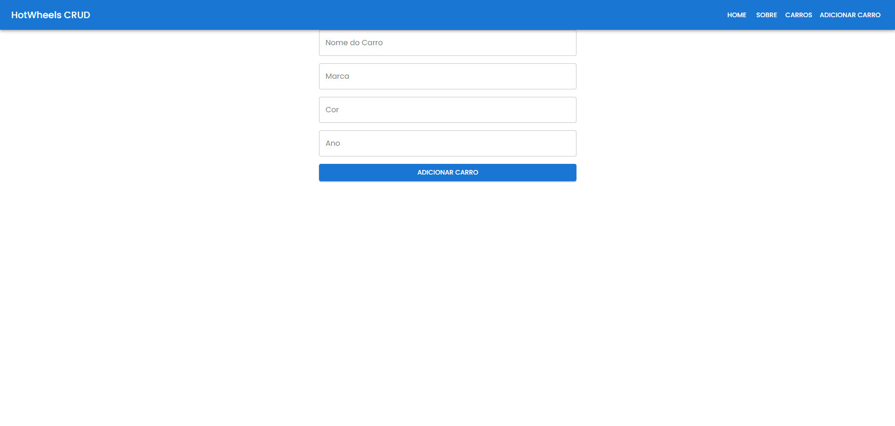

# Projeto Hotwheels

## Nome: `José Henrique Vieira Batista`

## Como Executar o Projeto Frontend

Para executar este projeto frontend, siga os passos abaixo:

1. Entre na pasta do projeto no terminal:

    ```bash
    cd hotwheels-crud
    ```

2. Rode `npm install` para instalar as dependências do projeto:

    ```bash
    npm install
    ```

3. Em seguida, inicie o servidor de desenvolvimento com:

    ```bash
    npm start
    ```

## Instalação e Execução da API

Este projeto frontend se comunica com uma API backend para gerenciar os dados dos carros. A API pode ser encontrada no repositório [hotwheels-api](https://github.com/adsPucrsOnline/DesenvolvimentoFrontend/) (branch `main`). Siga os passos abaixo para instalar e executar a API:

1. Clone o repositório da API localmente com o seguinte comando:

    ```bash
    git clone https://github.com/adsPucrsOnline/DesenvolvimentoFrontend.git
    ```

2. Navegue até o diretório da API:

    ```bash
    cd DesenvolvimentoFrontend/hotwheels-api
    ```

3. Instale as dependências necessárias para a API:

    ```bash
    npm install
    ```

4. Inicie o servidor da API:

    ```bash
    npm start
    ```

A API estará disponível em `http://localhost:5000` (ou na porta configurada no projeto).

Após a execução do projeto, este é o resultado esperado no navegador:






## Introdução

Feito para um trabalho da matéria de Desenvolvimento de Sistemas frontend da PUC-RS. Este projeto é uma aplicação CRUD básica para gerenciar uma lista de carros. Utiliza Create React App como base e inclui funcionalidades para adicionar, listar e remover carros. A navegação entre as páginas é gerenciada com React Router, e feedbacks visuais são fornecidos ao usuário para as ações de adicionar e remover carros.

## Componentes

Os componentes estão no diretório `./src/components` e possuem as seguintes características:

-   **NavBar**:

    -   **Descrição**: Este componente utiliza `Link` do React Router para exibir os links de navegação da aplicação. A sequência dos links é: Home, Sobre, Carros, Adicionar Carro.

-   **CarList**:

    -   **Props**:
        -   `cars`: um array contendo a lista de carros a ser exibida;
        -   `removeCar`: função callback que é chamada quando o botão "Excluir" é clicado para remover um carro da lista.
    -   **Descrição**: Este componente renderiza a lista de carros e permite excluir itens. Inclui um link para acessar o formulário de adicionar carros.

-   **CarForm**:

    -   **Props**:
        -   `addCar`: função callback que é chamada quando o formulário é enviado para adicionar um novo carro.
    -   **Descrição**: Este componente contém um formulário com campos para Nome, Marca, Cor e Ano do carro. Permite adicionar um carro à lista.

-   **Home**:

    -   **Descrição**: Componente de página inicial com uma breve introdução ao aplicativo.

-   **About**:
    -   **Descrição**: Componente de página "Sobre" que fornece informações sobre o aplicativo.

## Feedback Visual

-   **Adicionar Carro**: Mensagem de sucesso exibida em verde ao adicionar um carro.
-   **Remover Carro**: Mensagem de sucesso exibida em vermelho ao remover um carro.

## Testes

Os testes são uma parte essencial do desenvolvimento deste projeto. Eles garantem que os componentes funcionem conforme o esperado.

1. Para executar os testes, utilize o seguinte comando:

    ```bash
    npm test
    ```

Isso executará os testes definidos nos arquivos de teste dentro do diretório `./src/components`. O Jest é utilizado para testar a funcionalidade dos componentes React, e você verá um relatório com o resultado dos testes.

### Estrutura dos Testes

Os testes são configurados para verificar:

-   **Componentes de Renderização**: Confirma se os componentes renderizam corretamente com as props fornecidas.
-   **Funções de Callback**: Verifica se funções como `addCar` e `removeCar` são chamadas corretamente e interagem como esperado.
-   **Feedback Visual**: Confirma se as mensagens de feedback são exibidas corretamente após ações do usuário.

## Conclusão

Este projeto demonstra a construção de uma aplicação CRUD básica com React e React Router, oferecendo uma visão prática de como gerenciar o estado da aplicação e fornecer feedbacks visuais ao usuário. É um exemplo útil para o desenvolvimento de projetos mais complexos em ReactJS.
